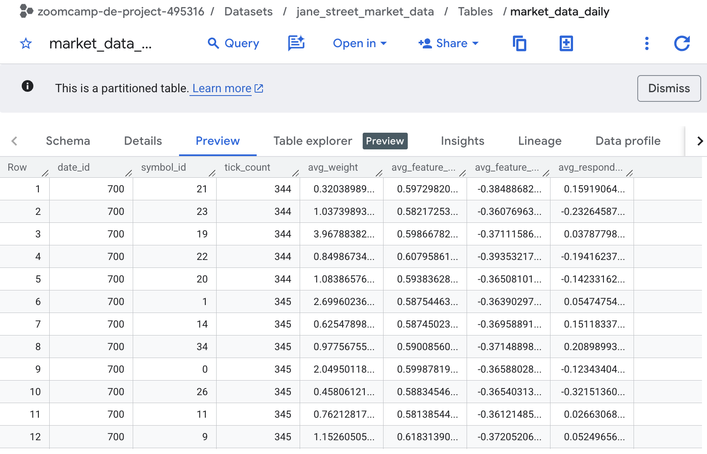

# Problem Statement

The goal of this project is to analyze the data of the Jane Street Real-Time Market Data Forecasting competition on Kaggle and create a dashboard to visualize the results. Here we focus on the data engineering aspects of the project, leaving the forecasting part for another time.

Financial market data is a good example of streaming data, as the timeliness and accuracy of the data stream is of utmost importance. The enormous amount of data that's theoretically available makes it also incumbent to partition the data and use efficient storage and processing methods (such as Spark's lazy loading).

The goal is to visualize the data and provide insights into the market data using a dashboard. But doing so by loading the whole dataset into memory locally would likely crash the system, so we need to use efficient storage and processing methods.

# Dataset

The dataset can be found here: https://www.kaggle.com/competitions/jane-street-market-prediction/data

Once registered to the competition, the dataset can be downloaded using the Kaggle API:

```bash
kaggle competitions download -c jane-street-real-time-market-data-forecasting
```

# System Design

We will use an ELT (Extract, Load, Transform) approach. First, we will extract the data from the raw parquet files, load them into a data lake on GCP, and then transform them into a format suitable for analysis via BigQuery. 


## Architecture

This project implements an end-to-end streaming data pipeline using the following technologies:
1. **Infrastructure as Code**: Terraform is used to provision Google Cloud Storage (Data Lake) and BigQuery (Data Warehouse).
2. **Streaming Ingestion**: Apache Kafka (run locally via Docker Compose) handles the simulated real-time stream. A Python producer reads the Kaggle `.parquet` dataset and publishes it to Kafka.
3. **Stream Processing**: Apache Flink (PyFlink) consumes the Kafka topic for real-time monitoring and processing.
4. **Orchestration & Data Movement**: Apache Airflow orchestrates the movement of data from Kafka directly to GCS. It uses an in-memory buffer to stream data to the cloud, ensuring **zero local disk usage** for storage.
5. **Data Warehouse & Transformations**: Data is loaded into BigQuery, where `dbt` is used to create an aggregated, partitioned table.
6. **Dashboard**: Looker Studio connects to BigQuery for visualization.


## How to Run

### 1. Environment Setup
Ensure you have [uv](https://docs.astral.sh/uv/) and Docker installed.
```bash
make init-env
source .venv/bin/activate
```

### 2. Infrastructure Deployment (GCP)
```bash
make tf-init
make tf-apply
```

### 3. Start Services (Kafka & Airflow)
Start the local infrastructure. This includes Kafka, Zookeeper, and the Airflow stack as discussed in the course.
```bash
make docker-up
make airflow-init  # Run once to initialize Airflow DB
make airflow-up    # Start Airflow webserver and scheduler
```

### 4. Run the Pipeline
1. **Producer**: Start the Kafka producer to simulate the stream:
   ```bash
   make run-producer
   ```
2. **Flink**: Start the processor for real-time monitoring:
   ```bash
   make run-flink
   ```
3. **Airflow**: Open `http://localhost:8080` (airflow/airflow) and turn on the `kafka_to_gcs_direct` DAG. This will sync Kafka data to GCS every 5 minutes in memory.





### 5. Run dbt Transformations
Once data is in GCS/BigQuery, run dbt, to consolidate the data by grouping it by date and symbol which we can then display on a dashboard:
```bash
make dbt-run
```

## Looker Studio Dashboard Setup

To create a dashboard with at least 2 tiles (e.g., Average Weight by Date, and Tick Volume by Symbol):

1. Go to [Looker Studio](https://lookerstudio.google.com/).
2. Click **Create** > **Data Source**.
3. Select **BigQuery** > **My Projects** > `zoomcamp-de-project-495316` > `jane_street_market_data` > `market_data_daily`.
4. Click **Connect**.
5. Create a new Report.
6. **Tile 1 (Time Series)**: Add a Time Series chart. Set Date Range Dimension to `date_id`, Dimension to `date_id`, and Metric to `avg_weight`.
7. **Tile 2 (Bar Chart)**: Add a Bar Chart. Set Dimension to `symbol_id`, and Metric to `tick_count`. Sort descending to see the most traded symbols.
